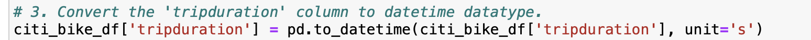
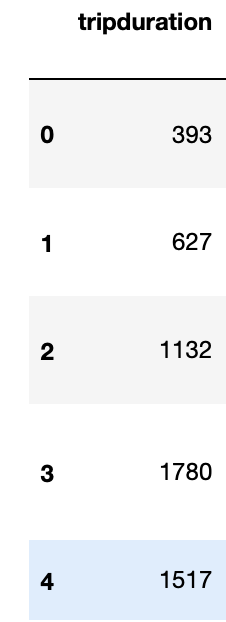
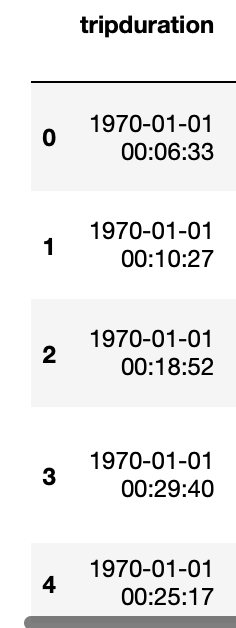
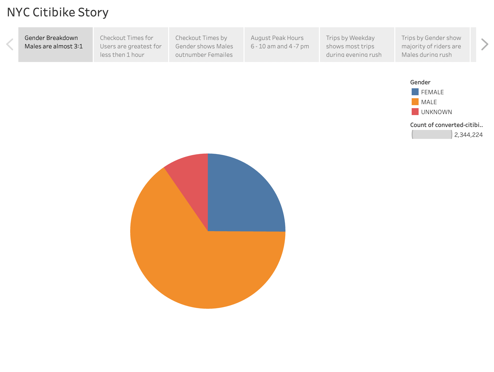
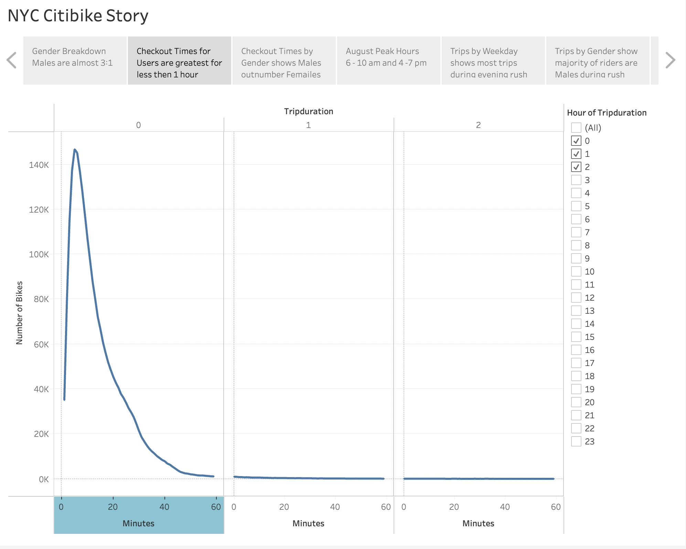
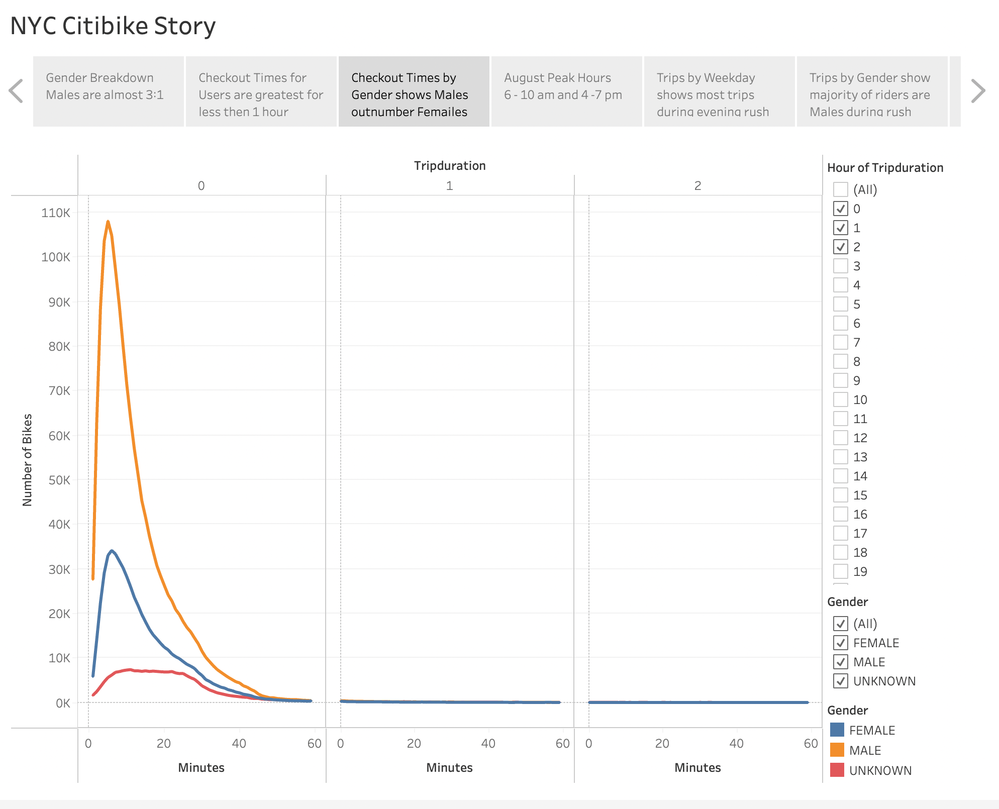
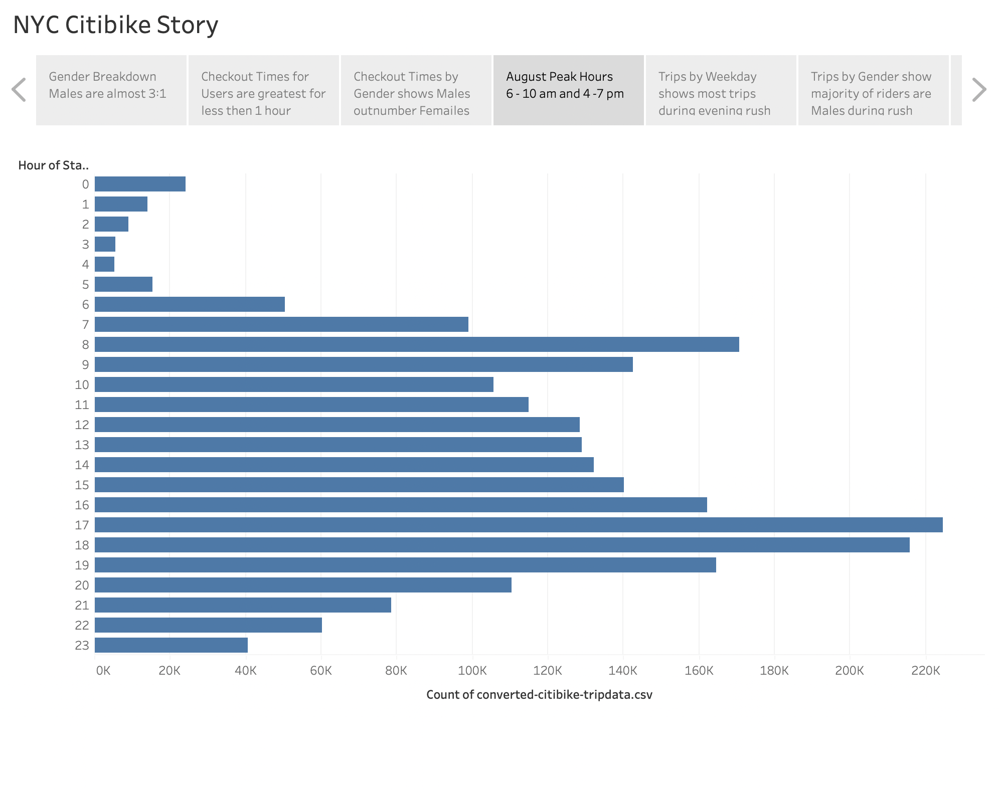
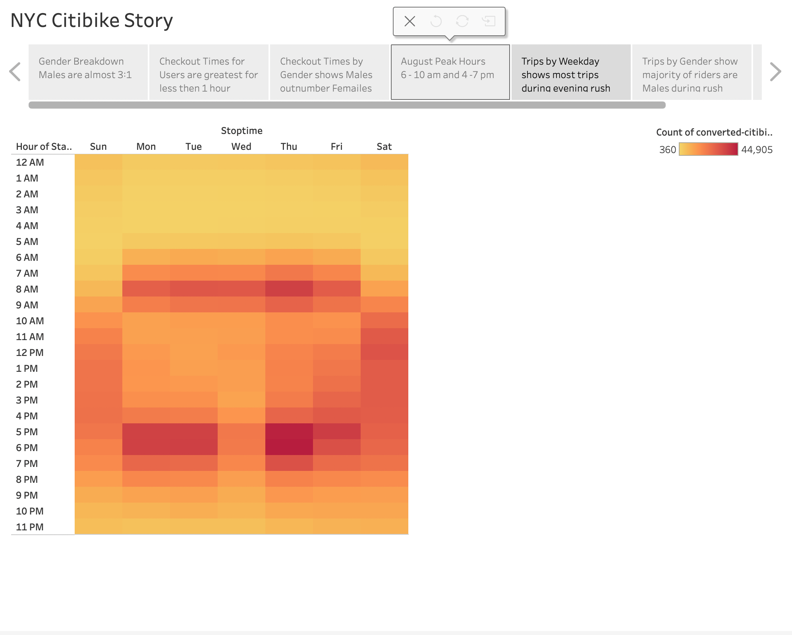
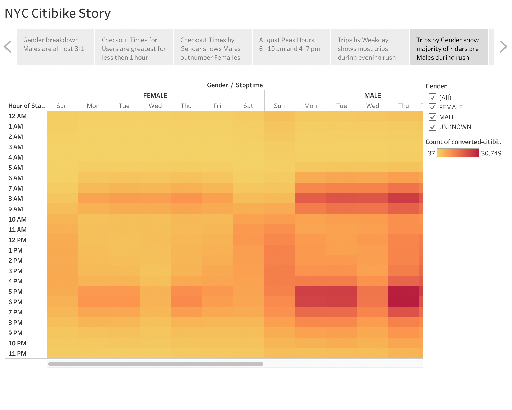
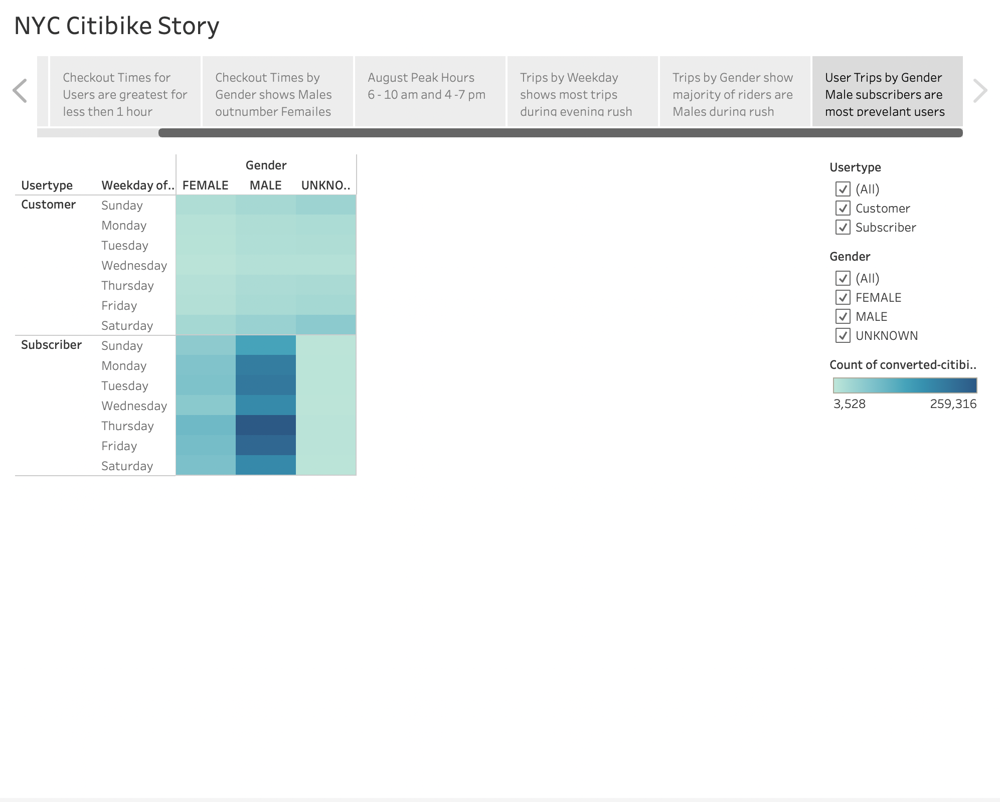

## NYC CitiBike Sharing

### Overview
This analysis of bike-sharing data from the New York City CitiBike system will help investors determine if a bike-sharing program in Des Moines, Iowa is a solid investment. 

### Details of Analysis
#### Data
The analysis begins with trip data for August 2019.  The data includes the following columns: __Tripduration, Starttime, Stoptime, Start station id, Start station name, Start station latitude, Start station longitude, End station id, End station name, End station latitude, End station longitude, Bikeid, Usertype, Birth year, Gender__.
#### Conversion of Tripduration
The Tripduration needed to be converted from an integer that represented seconds to a datetime variable that represents minutes.  Here is look at the conversion code done in Jupyter notebook using pandas:  

  
 This shows that __tripduration__  in the first graphic and then converts seconds to minutes by changing the data type from int64 to datetime 
  -------->> 
  
 #### Tableau for Story Telling
 Once the conversion was made to the data it was then exported using pandas to a new csv file.  This file was then read into __Tableau Public__. After creating  visualizations from the data A Tableau story is a created by sequencing those visualizations.  This helps audiences see the bigger picture.  The Tableau story for this analysis has seven different pages and hopefully through viewing the information the investors will be able to make an informaed decision.  
 You can view and interact with the file here: [NYC CitiBike Story](https://public.tableau.com/app/profile/linda.berez/viz/NYC_Citibike_Story_16236415203950/NYCCitibikeStory)
 
 ### Results
  #### Gender Breakdown
   
 The Tableau story begins with a pie chart of the breakdown by gender of the riders.  Each additional page will build on how gender is an influencer in who uses the bikes and when.  We can see that while there are some unknown genders of riders the overall majority of riders is male.  
 #### Checkout Times for Users
   
#### Checkout Times by Gender
 
#### August Peak Hours
 
#### Trips by Weekday per Hour 
 
#### Trips by Gender by Weekday 
 
#### User Trips by Gender by Weekday
 
